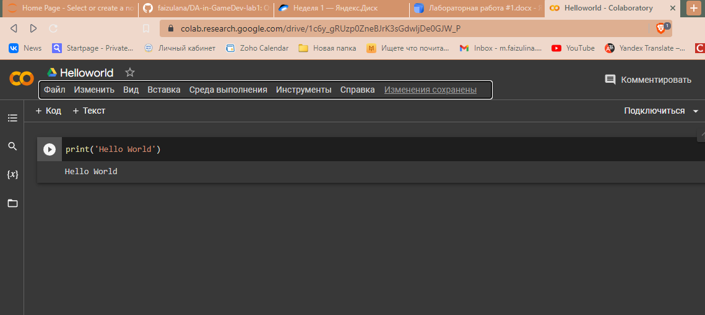
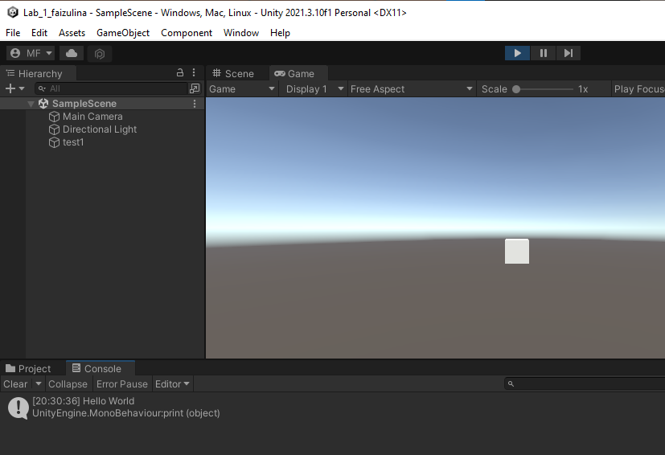

# АНАЛИЗ ДАННЫХ И ИСКУССТВЕННЫЙ ИНТЕЛЛЕКТ [in GameDev]
Отчет по лабораторной работе #1 выполнил(а):
- Файзулина Милана Мансуровна
- РИ000024
Отметка о выполнении заданий (заполняется студентом):

| Задание | Выполнение | Баллы |
| ------ | ------ | ------ |
| Задание 1 | * | 60 |
| Задание 2 | * | 20 |
| Задание 3 | * | 20 |

знак "*" - задание выполнено; знак "#" - задание не выполнено;

Работу проверили:
- к.т.н., доцент Денисов Д.В.
- к.э.н., доцент Панов М.А.
- ст. преп., Фадеев В.О.

[](https://nodesource.com/products/nsolid)

[](https://travis-ci.org/joemccann/dillinger)

Структура отчета

- Данные о работе: название работы, фио, группа, выполненные задания.
- Цель работы.
- Задание 1.
- Код реализации выполнения задания. Визуализация результатов выполнения (если применимо).
- Задание 2.
- Код реализации выполнения задания. Визуализация результатов выполнения (если применимо).
- Задание 3.
- Код реализации выполнения задания. Визуализация результатов выполнения (если применимо).
- Выводы.
- ✨Magic ✨

## Цель работы
Ознакомиться с основными операторами зыка Python на примере реализации линейной регрессии.

## Задание 1.1
Python:



Unity:



## Задание 1
### Пошагово выполнить каждый пункт раздела "ход работы" с описанием и примерами реализации задач
Ход работы:
- Произвести подготовку данных для работы с алгоритмом линейной регрессии. 10 видов данных были установлены случайным образом, и данные находились в линейной зависимости. Данные преобразуются в формат массива, чтобы их можно было вычислить напрямую при использовании умножения и сложения.

```py

In [ ]:
#Import the required modules, numpy for calculation, and Matplotlib for drawing
import numpy as np
import matplotlib.pyplot as plt
#This code is for jupyter Notebook only
%matplotlib inline

# define data, and change list to array
x = [3,21,22,34,54,34,55,67,89,99]
x = np.array(x)
y = [2,22,24,65,79,82,55,130,150,199]
y = np.array(y)

#Show the effect of a scatter plot
plt.scatter(x,y)

#Define the basic linear regression model wx+ b
def model(a, b, x):
    return a*x + b

#Define the function of mean variance difference
def loss_function(a, b, x, y):
    num = len(x)
    prediction=model(a,b,x)
    return (0.5/num) * (np.square(prediction-y)).sum()

#To define the optimization function using partial derivatives to update two parameters a and b
def optimize(a,b,x,y):
    num = len(x)
    prediction = model(a,b,x)
#Update the values of A and B by finding the partial derivatives of the loss
#function on a and b
    da = (1.0/num) * ((prediction -y)*x).sum()
    db = (1.0/num) * ((prediction -y).sum())
    a = a - Lr*da
    b = b - Lr*db
    return a, b

#iterated function, return a and b
def iterate(a,b,x,y,times):
    for i in range(times):
        a,b = optimize(a,b,x,y)
    return a,b


#Initialize parameters and display
a = np.random.rand(1)
print(a)
b = np.random.rand(1)
print(b)
Lr = 0.000001

#For each iteration, the parameter values, losses, and visualization after the
#iteration are displayed
a,b = iterate(a,b,x,y,1)
prediction=model(a,b,x)
loss = loss_function(a, b, x, y)
print(a,b,loss)
plt.scatter(x,y)
plt.plot(x,prediction)

a,b = iterate(a,b,x,y,2)
prediction=model(a,b,x)
loss = loss_function(a, b, x, y)
print(a,b,loss)
plt.scatter(x,y)
plt.plot(x,prediction)

a,b = iterate(a,b,x,y,3)
prediction=model(a,b,x)
loss = loss_function(a, b, x, y)
print(a,b,loss)
plt.scatter(x,y)
plt.plot(x,prediction)

a,b = iterate(a,b,x,y,4)
prediction=model(a,b,x)
loss = loss_function(a, b, x, y)
print(a,b,loss)
plt.scatter(x,y)
plt.plot(x,prediction)

a,b = iterate(a,b,x,y,5)
prediction=model(a,b,x)
loss = loss_function(a, b, x, y)
print(a,b,loss)
plt.scatter(x,y)
plt.plot(x,prediction)

a,b = iterate(a,b,x,y,10000)
prediction=model(a,b,x)
loss = loss_function(a, b, x, y)
print(a,b,loss)
plt.scatter(x,y)
plt.plot(x,prediction)

```

- Определите связанные функции. Функция модели: определяет модель линейной регрессии wx+b. Функция потерь: функция потерь среднеквадратичной ошибки. Функция оптимизации: метод градиентного спуска для нахождения частных производных w и b.


## Задание 2
### Должна ли величина loss стремиться к нулю при изменении исходных данных? Ответьте на вопрос, приведите пример выполнения кода, который подтверждает ваш ответ.
 Величина loss должна стремиться к нулю в процессе оптимизации, так как величина loss зависит от изменения подобранных весов. Чем лучше обучена модель, тем точнее будут предсказания, а значит меньше будет значение loss. Это можно увидеть на примере кода из задания 1: при каждой итерации значение loss становится меньше. 
 
## Задание 3
### Какова роль параметра Lr? Ответьте на вопрос, приведите пример выполнения кода, который подтверждает ваш ответ. В качестве эксперимента можете изменить значение параметра.
Lr - это learning Rate, коэффициент скорости обучения. Он определяет, насколько будут меняться веса параметров
 при каждой итерации. От него зависят возможная точность получившейся модели и скорость ее обучения. 
 Понять роль этого параметра можно рассмотрев функцию Optimize, определенную выше, в которой коэффициенты a и b изменяются на
 значение производной, умноженное на коэффициент Lr. Чем выше коэффициент, тем больший "шаг" будет у функции
 Увидеть действие параметра также можно, изменив его значение и сравнив получившиеся графики с исходными. Чем выше коэффициент, 
 тем больше разница в угловых коэффициентах прямых, выводимых в процессе оптимизации. 

## Выводы

В ходе выполнения работы я ознакомилась с основами работы с GitHub и Unity и приобрела понимание, как реализуется простой алгоритм линейной регрессии. 

| Plugin | README |
| ------ | ------ |
| Dropbox | [plugins/dropbox/README.md][PlDb] |
| GitHub | [plugins/github/README.md][PlGh] |
| Google Drive | [plugins/googledrive/README.md][PlGd] |
| OneDrive | [plugins/onedrive/README.md][PlOd] |
| Medium | [plugins/medium/README.md][PlMe] |
| Google Analytics | [plugins/googleanalytics/README.md][PlGa] |

## Powered by

**BigDigital Team: Denisov | Fadeev | Panov**
